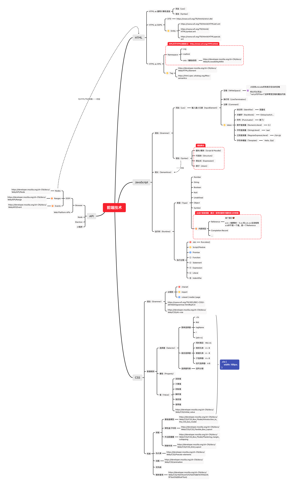

# week01周总结
本周主要是学习认识阶段，Get到了学习方法和整体对于前端体系的一个认知

## 学习方法
### 整理法
通过对知识进行整理进行关系练习梳理，从而打造出知识结构。一般知识间的关系有如下几种
#### 顺序关系
按照一定流程走下来：父节点 => 子节点（父节点第一步）=> 子节点（父节点第二步）
#### 组合关系
组合关系：父节点 => 子节点（父节点的头）=> 子节点（父节点的身体）=> 子节点（父节点的脚）
#### 纬度关系
[不太理解，用得少]纬度关系：多个角度来看进行分析
#### 分类关系
分类关系：父节点 => 子节点（父节点的第一类孩子）=> 子节点（父节点的第二类孩子）=> 子节点（父节点的第三类孩子）
### 追溯法

### 追溯法
追本溯源，对于知识进行理解和分析，辨别知识的正确性
#### 如何追本溯源
通过以下线索进行追本溯源，从而保障信息的可靠和权威
- 源头
  - 最早出现的地方，最早的实现案例
- 标准和文档
  - [w3c](https://w3.org)
  - [mdn](https://developer.mozilla.org)
  - [whatwg](https://whatwg.org/)
  - [微软相关知识论坛](https://msdn.microsoft.com)
  - [苹果相关知识论坛](https://developer.apple.com/)
- 看权威专家的言论

## 前端能力
### 能力分类
内功知识（最底层，任何程序员通用）
- 编程能力：难的东西，能不能写出来
- 架构能力：大的东西，能不能写出来
- 工程能力：解决多人协作的问题

前端知识（前端特有）

领域知识（业务特有）：业务相关领域知识

### 能力提升
内功知识：刻意练习
  - 编程能力：刷算法题提升
  - 架构能力：读源码，参与开源项目。读源码方式：通过解一个issue带着目的去读，而不是通读
  - 工程能力：工作中进行争取

前端知识
  - 前端训练营

领域知识
  - 参与业务进行总结实践

## 前端工程化
### 明确什么是一个优秀的前端研发
1. 前端知识充足，并形成体系
2. 当前能力值稳定且潜力（上限）高
  - 【能力】编程
  - 【能力】架构
  - 【能力】工程
  - 【潜力/上限】业务敏感度，做事方法论
3. 有清晰明确的职业规划

### 如何展示你是一个优秀的研发
通过你的成就可以快速的让别人知道你的能力

### 成就方法论
成就路径：
成长（学习积累） => 成就（作出东西有沉淀） => 晋升（获取更多资源和平台）=> 成长...

成就分类：
- 业务型成就：了解业务目标，通过数据驱动完成
- 工程型成就：建设工具链，技术架构，持续集成
- 技术难题型成就：解决公认技术难题

## 前端知识图谱【本周作业】

## url解析作业
[url解析作业](./url-resolve.js)

## 问题
关于纠结学了就忘这回事：会导致你会花很多时间去想这个知识有没有用。而拿这些去学，说不定就有一两个你用上了。不可能存在学了必用，永不过时的知识
